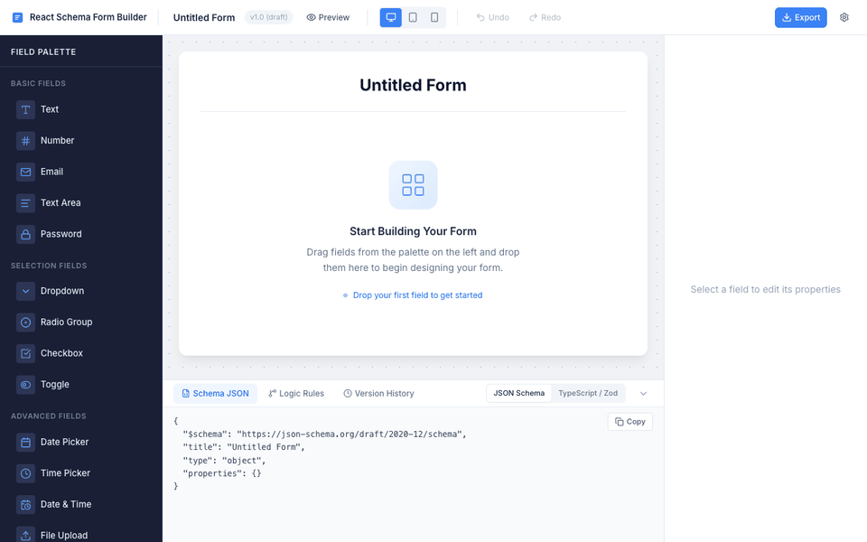
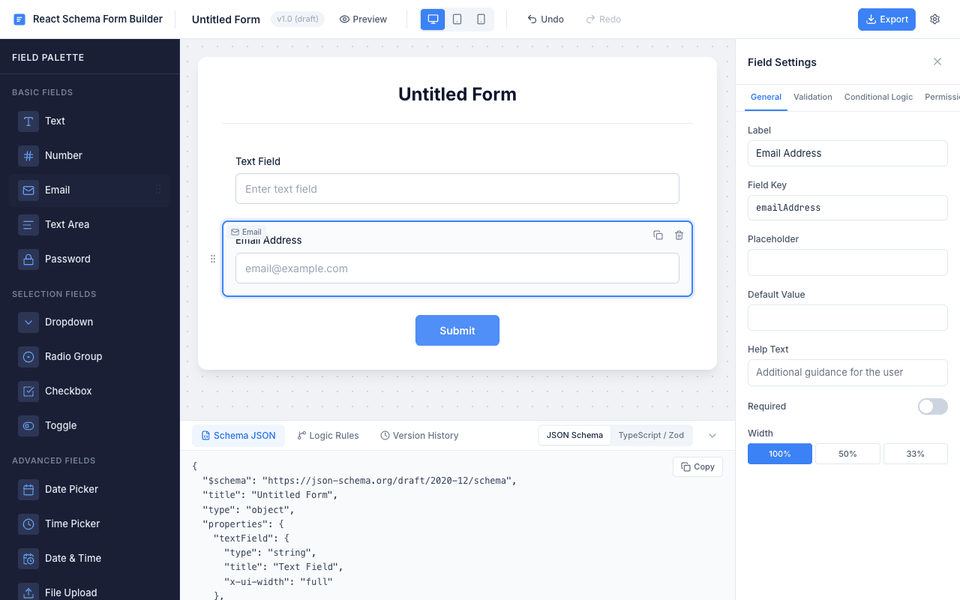
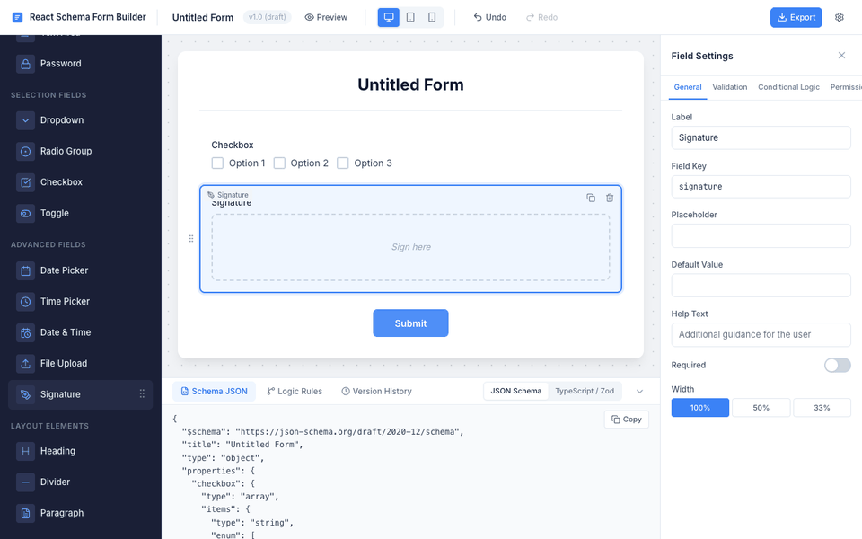
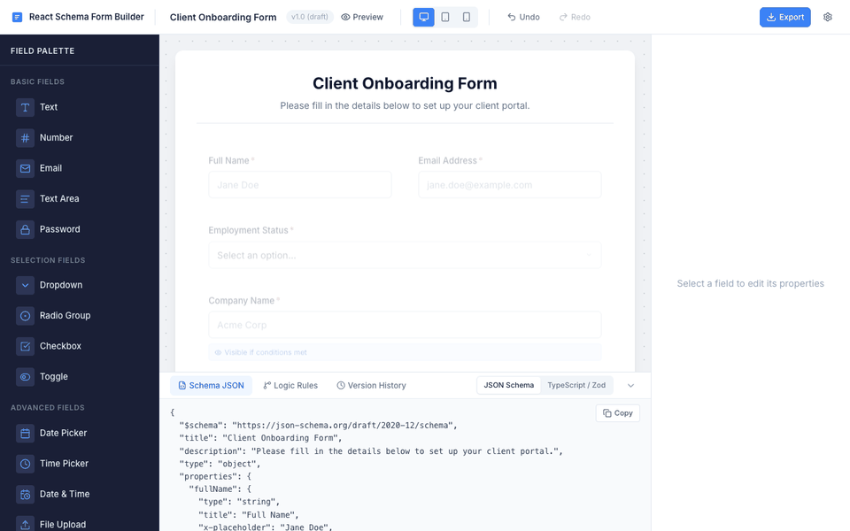

# JSON Schema Form Builder 🎨📋

A premium, schema-driven visual form building system for React. Design highly interactive forms via drag & drop, configure complex validation rules and conditional logic visually, and instantly export production-ready React components, standard **JSON Schema (Draft 2020-12)**, and **Zod validation code**.

[](https://www.npmjs.com/package/@bhagyeshhjain/json-schema-form-builder)
[](LICENSE)
[]()
[](https://github.com/bhagyeshhjain/json-schema-form-builder/pulls)

---

## ✨ Features

- 🖱️ **Intuitive Drag & Drop**: Effortlessly add, delete, duplicate, and reorder fields on a fluid designer canvas.
- 📐 **Flexible Layout Grid**: Change field widths to **100% (Full)**, **50% (Half)**, or **33% (Third)** to build compact multi-column form layouts.
- 👁️ **Visual Conditional Logic**: Create dynamic visibility rules (e.g., *Show a field only when another field equals a specific value*) using a visual query builder.
- 🛡️ **Robust Validation Builder**: Define custom error messages, min/max values, length bounds, and custom **regex pattern constraints** easily.
- 💻 **Multiple Code Exporters**:
  - **Standalone React Component**: Clean, typescript-safe React code utilizing `react-hook-form` and `zod` validation that you can drop directly into your project.
  - **JSON Schema**: Standard Draft 2020-12 JSON Schema, fully compatible with existing form engines (e.g., react-jsonschema-form).
  - **Zod Schema**: Fully compiled typescript Zod schemas for server-side or client-side form validation.
- 📱 **Interactive Live Preview**: Switch to preview mode anytime to interact with your form, simulate input validation, and verify responsiveness across Desktop, Tablet, and Mobile viewports.
- 🕒 **History Management**: Built-in undo/redo capability (`Ctrl+Z` / `Ctrl+Shift+Z`) and temporal state saving.

---

## 📸 Visual Usage Guide

### 1. Drag, Drop & Reorder Fields
Easily assemble form layouts by clicking or dragging fields from the organized left-side palette. Drag by the handle to reorder fields smoothly.



### 2. Configure Field & Grid Settings
Click on any canvas field to slide open the general properties panel. Update labels, placeholders, and default values, set mandatory flags, and toggle width states (100% / 50% / 33%) for beautiful responsive rows.



### 3. Dynamic Conditional Logic
Make your forms interactive by setting conditional display triggers. Reveal specialized inputs (such as Signature or File Upload) only when prerequisite fields (like Dropdowns or Toggles) meet specific values.



### 4. Interactive Preview & Code Export
Preview the end-user form flow, check mobile and tablet breakpoints, validate inputs in real-time, and download your ready-to-run React TSX components or JSON specifications with a single click.



---

## 🚀 Getting Started

### 1. Installation

Install the visual builder and its peer dependencies in your React application:

```bash
npm install @bhagyeshhjain/json-schema-form-builder
```

> **Note:** This package requires `react` and `react-dom` (v18 or v19) as peer dependencies. If they're not already in your project:
> ```bash
> npm install react react-dom
> ```

### 2. Rendering the Visual Builder

Import the main `FormBuilder` workspace into your React/TypeScript application:

```tsx
import React from 'react';
import { FormBuilder } from '@bhagyeshhjain/json-schema-form-builder';
import '@bhagyeshhjain/json-schema-form-builder/styles'; // Bundle styles

export default function App() {
  return (
    <div style={{ width: '100vw', height: '100vh' }}>
      <FormBuilder />
    </div>
  );
}
```

---

## ⚡ Integrating Generated Code

### Option A: Using the Exported Standalone React Component

When you export a **React Component** from the toolbar, you receive a completely self-contained, typed, and validated TSX component.

#### 1. Install standard form dependencies:
```bash
npm install react-hook-form @hookform/resolvers zod
```

#### 2. Import and render the exported form:
```tsx
import React from 'react';
import { GeneratedForm } from './ClientOnboardingForm'; // The downloaded component

export default function MyFormPage() {
  const handleFormSubmit = (data: any) => {
    console.log("Collected Form Data:", data);
  };

  return (
    <div className="container">
      <h2>Welcome Aboard!</h2>
      <GeneratedForm onSubmit={handleFormSubmit} />
    </div>
  );
}
```

---

### Option B: Integrating the JSON Schema

If you prefer to store or parse form structures dynamically, the exported **JSON Schema (Draft 2020-12)** includes custom `x-ui-width` layout cues and is fully compliant with standard parsers:

```json
{
  "$schema": "https://json-schema.org/draft/2020-12/schema",
  "title": "Client Onboarding Form",
  "type": "object",
  "properties": {
    "fullName": {
      "type": "string",
      "title": "Full Name",
      "minLength": 2,
      "x-ui-width": "half"
    },
    "emailAddress": {
      "type": "string",
      "format": "email",
      "title": "Email Address",
      "x-ui-width": "half"
    }
  },
  "required": ["fullName", "emailAddress"]
}
```

---

## 📦 Supported Field Types

| Group | Field Type | Key Visual / Output Behaviors |
| :--- | :--- | :--- |
| **Basic Inputs** | `text`, `number`, `email`, `textarea`, `password` | Captures alphanumeric, numerical, structured email or hidden password strings with length caps. |
| **Selection UI** | `dropdown`, `radio`, `checkbox`, `toggle` | Configurable multi-option lists, binary toggle switches, and grouped options. |
| **Advanced** | `date`, `time`, `datetime`, `file`, `signature` | Native calendar components, file attachment upload slots, and visual drawing signature pads. |
| **Layouts** | `heading`, `divider`, `paragraph` | Rich semantic structural markup (h1-h4 headings, thematic dividers, text paragraphs). |

---

## 🛠️ Custom Theme Customization

The Form Builder uses global CSS custom properties to let you inject your company's aesthetic. Override these variables in your global stylesheet:

```css
:root {
  /* Colors */
  --color-primary-500: #3b82f6;     /* Accent brand color */
  --color-primary-600: #2563eb;
  --color-neutral-900: #0f172a;     /* Deep headers */
  --color-canvas-bg: #f8fafc;       /* Designer canvas background */
  
  /* Radii & Shadows */
  --radius-xl: 12px;
  --shadow-lg: 0 10px 15px -3px rgba(0, 0, 0, 0.1);
}
```

---

## 📄 License

MIT License. See [LICENSE](LICENSE) for details.

Created by [@bhagyeshhjain](https://github.com/bhagyeshhjain).
